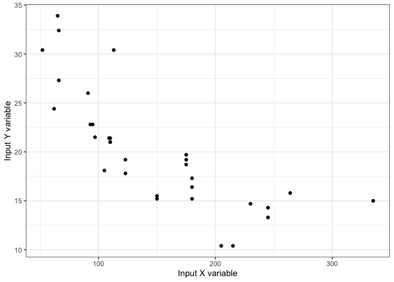
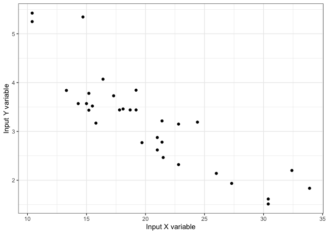

<!-- README.md is generated from README.Rmd. Please edit that file -->

# B2package

<!-- badges: start -->
<!-- badges: end -->

## Overview

The `B2package` allows users, via the `data_snapshot()` function, to
quickly assess summary statistics for and the relationship between two
numeric variables from a given dataset.

The `B2package` was created for Assignment B2 as part of STAT545B in the
fall of 2021. (more information about the assignment for making an R
package and instructions for putting the package together may be found
here: [link](https://stat545.stat.ubc.ca/assignments/assignment-b2/))

The goal of `B2package` is to provide a package that contains a
function, `data_snapshot()`, that helps to provide a quick and useful
snapshot of one’s numeric data. Specifically, the function in this
package provides a data snapshot of two numeric variables, by returning
summary statistics for the numeric variables (mean, median, min and
max), as well as a visualization (scatterplot) and the adjusted R
squared value to provide a sense of the linear relationship between the
variables (if any). Generally, the adjusted r squared value, a value
between 0 and 1 (returned as a percentage by the function), represents
the proportion of variance observed for a dependent variable explained
by the independent variable in a linear regression model. The
`data_snapshot()` function therefore allows users of the `B2package` to
quickly get a sense of the relationship between two numeric variables in
a given dataset (for example, data from a tibble).

## Installation

B2package is not yet on CRAN. But, you can download it from this
repository using the following R command:

``` r
devtools::install_github("hansudd/AssnB2")
```

And the development version from [GitHub](https://github.com/) with:

``` r
# install.packages("devtools")
devtools::install_github("hansudd/AssnB2", ref = "0.1.0")
```

## Examples

**Example 1:** This is an example that shows you how to quickly
visualize and assess the relationship between two numeric variables:

``` r
# loading the B2package package
library(B2package)

# we will use two numeric variables from the mtcars dataset, a well known dataset that comes with CRAN

## example 1 of the data_snapshot function 
data_snapshot(mtcars, hp, mpg)
#> [[1]]
#>   max min     mean median
#> 1 335  52 146.6875    123
#> 
#> [[2]]
#>    max  min     mean median
#> 1 33.9 10.4 20.09062   19.2
#> 
#> [[3]]
```



    #> 
    #> [[4]]
    #> [1] "Adjusted R-square is 58.92 %"

Example 1 shows the linear relationship between two numeric variables
from the `mtcars` dataset, hp vs mpg. We observe an adjusted r-squared
value of 58.92 %. Example 2 will feature an example where there is a
stronger linear relationship between the two variables.

**Example 2:** This is another example that shows you how to quickly
visualize and assess the relationship between two numeric variables:

``` r
# we will use the mtcars dataset, but this time change the mpg variable to the wt variable

# example 2 of the data_snapshot function
data_snapshot(mtcars, mpg, wt)
#> [[1]]
#>    max  min     mean median
#> 1 33.9 10.4 20.09062   19.2
#> 
#> [[2]]
#>     max   min    mean median
#> 1 5.424 1.513 3.21725  3.325
#> 
#> [[3]]
```



    #> 
    #> [[4]]
    #> [1] "Adjusted R-square is 74.46 %"

Example 2 shows the linear relationship between the variables mpg and wt
from the `mtcars` dataset. Here, we report a higher adjusted r-squared
value of 74.46 %. Our function therefore suggests a stronger linear
relationship exists between these two numeric variables, in contrast to
the variables used in Example 1.

## Summary

Hence, from these two usage examples, we see that the `data_snapshot`
function returns summary statistics (two tibbles containing the min,
max, mean and median for each numeric variable), a scatterplot and the
adjusted r squared value when fed two numeric variables.

This package is helpful if you frequently work on datasets with two
numeric variables, and you want to quickly determine if there is a
linear relationship between the variables.
